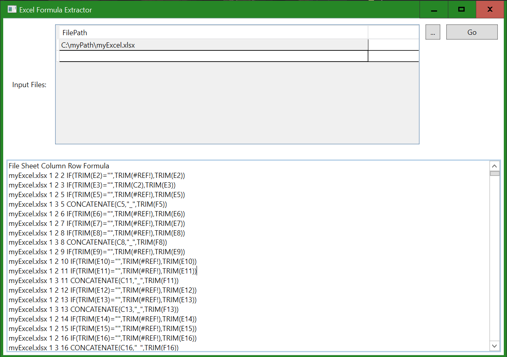
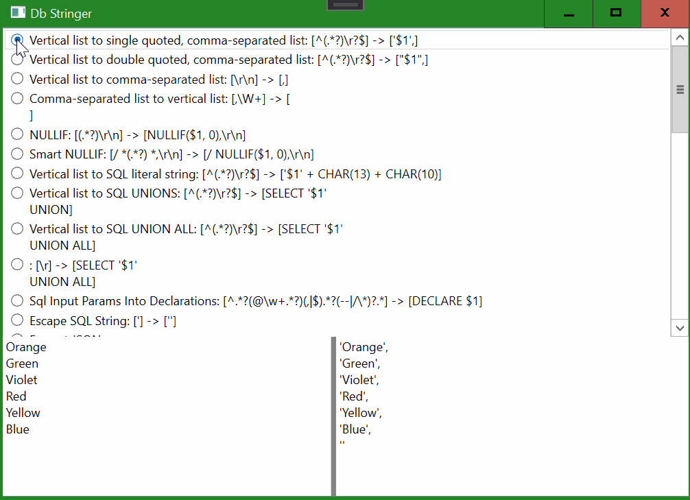
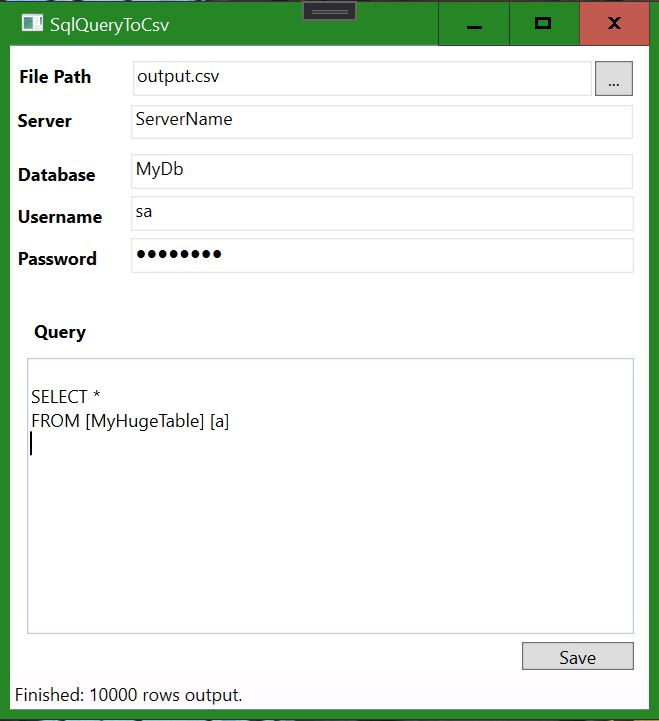

# DataToolChain - Utilities for Data 🆕
For people that deal with data. A collection of utility applications that use [DataPowerTools](https://github.com/nh43de/DataPowerTools) to do some cool stuff. (And more coming soon!!)

## Installing Data Toolchain

DataToolChain is built with WPF on .NET Core 3.1. You can download and run the latest binaries from the [Releases](https://github.com/nh43de/DataToolChain/releases) page.

## Tools Included

### I. DataUploader

Upload data from multiple sources, including Excel, CSV, and more to SQL server. With data-fitting transformations and better error messages.

#### ✔️ Using DataUploader to Upload Excel & CSV Data

1. Enter SQL Server credentials and database information
2. Select files to upload by clicking "Browse..."
3. Set options or leave them as default
4. Click "GO"!

#### Data Uploader Options

##### Destination Server and database, username and password

Destination MS SQL Server server, database, and credentials (if using SQL server authentication). Cloud auth coming soon.

##### Configurable Destination Table

If entered in left-hand panel, all data will upload to this table. Alternatively can leave this blank and upload to specific tables per file.

If no table names are specified, data will upload to table of the same name as the file name minus extenson.

##### JSON Configuration

You can easily copy/paste JSON to allow for saving and storing uploader configuration.

##### 🔢 Advanced Configuration

- **Apply Default Transform Group** - gathers SQL schema information and attempts to transform any dates, numbers, bit values e.g. (Y/N), so that it will be able to upload to SQL server.
- **Truncate Tables First** - clears data from all tables used by executing a truncate table command.
- **Use Ordinals** - Normally the uploader will attempt to match by column name but use ordinals will override to upload based on column index instead.
- **Bulk Copy Rows per batch** - Number of rows per batch to use for SQLBulkCopy protocol.

### II. Excel Formula Extractor 🆕

Extracts formulas from given excel sheets. 

#### ✔️ Using Excel Formula Extractor

1. Select files to parse
1. Click "GO"!
1. Output is tab-separated and can be copied directly into Excel

### III. Excel vLookup Mover
				
This tool moves all vLookups in an Excel workbook into a sheet called "__data". This sheet can then be pasted as values to avoid performance issues with vLookups.

### IV. DbStringer

A collection of handy string operations. String together IN statements in SQL, or quickly sort or format items on the fly.

##### List of String Manipulation Features

 - Comma-separated list to vertical list
 - Distinct
 - Escape Regex
 - Escape SQL String
 - Format JSON
 - Generalize Regex - use ^^^ to enclose groups, and ___ to indicate a wildcard
 - NULLIF
 - Params to Tabs
 - Smart NULLIF
 - Sort
 - Sort by Length
 - SQL Columns to DECLARE statement
 - Sql Input Params Into Declarations
 - Tabs to params
 - Tabs to rows
 - Tabs to SQL Columns
 - Trim
 - Unescape regex
 - Vertical list to comma-separated list
 - Vertical list to double quoted, comma-separated list
 - Vertical list to single quoted, comma-separated list
 - Vertical list to SQL literal string
 - Vertical list to SQL UNION ALL
 - Vertical list to SQL UNIONS

### V. Sql Query to .csv

A high performance streaming implementation of outputting a SQL query to a comma-separated values (.csv) file using DataPowerTools. Great for outputting millions or billions of rows to a csv file without using SSMS. Also faster than SSMS or any other tool we've tested.

### VI. JUST Transformer Playground

Experiment with JUST transforms for querying and transforming JSON data (similar to XSLT).

More information here: https://github.com/WorkMaze/JUST.net

## Upcoming Additions

- Json to c# class
- More

