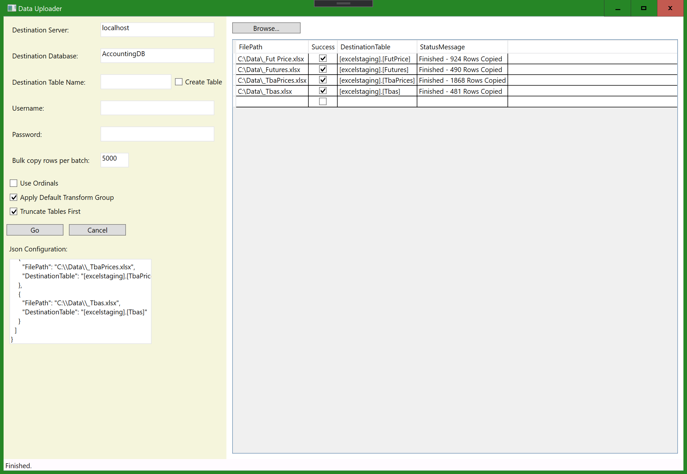

# DataToolChain - Utilities for Data 🆕
A collection of utility applications that use [DataPowerTools](https://github.com/nh43de/DataPowerTools) to do some cool stuff. (And more coming soon!!)

## DataUploader 🆕

Upload data from multiple sources, including Excel, CSV, and more to SQL server.

#### Destination Server and database, username and password

Destination MS SQL Server server, database, and credentials (if using SQL server authentication). Cloud auth coming soon.

#### Configurable Destination Table

If entered in left-hand panel, all data will upload to this table. Alternatively can leave this blank and upload to specific tables per file.

If no table names are specified, data will upload to table of the same name as the file name minus extenson.

#### 🔢 Advanced Configuration

- **Apply Default Transform Group** - gathers SQL schema information and attempts to transform any dates, numbers, bit values e.g. (Y/N), so that it will be able to upload to SQL server.
- **Truncate Tables First** - clears data from all tables used by executing a truncate table command.
- **Use Ordinals** - Normally the uploader will attempt to match by column name but use ordinals will override to upload based on column index instead.
- **Bulk Copy Rows per batch** - Number of rows per batch to use for SQLBulkCopy protocol.

### ✔️ Using DataUploader to Upload Excel & CSV Data

1. Enter SQL Server credentials and database information
2. Select files to upload by clicking "Browse..."
3. Set options or leave them as default
4. Click "GO"!

